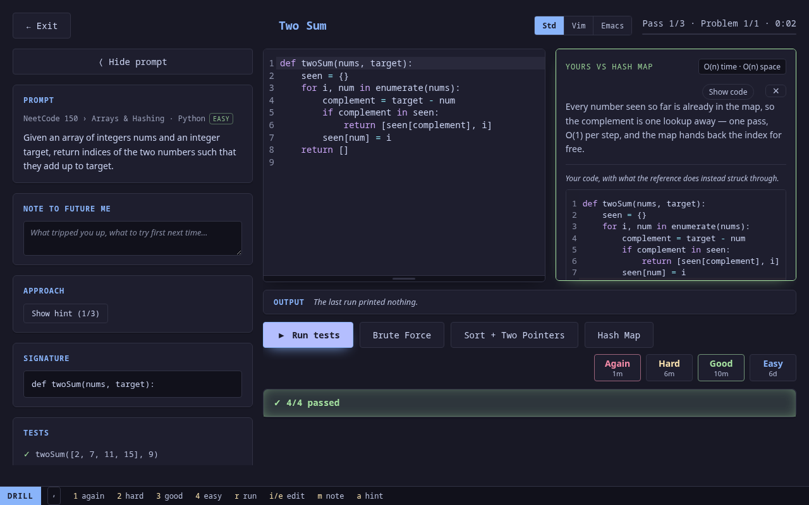
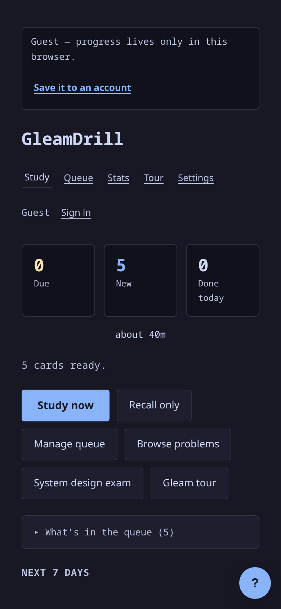

<h1 align="center">GleamDrill</h1>

<p align="center">
  Spaced-repetition drilling for algorithm problems — type the solution from memory, run it against real tests, grade yourself, and let FSRS decide when it comes back.
</p>

<p align="center">
  <a href="https://gleamdrill.com"><strong>gleamdrill.com</strong></a> · no account needed
</p>

<p align="center">
  <a href="https://github.com/gudetimes1234/gleamdrill/actions/workflows/ci.yml"></a>
  <a href="LICENSE"></a>
  <a href="https://gleam.run"></a>
  <a href="https://github.com/sponsors/gudetimes1234"></a>
</p>

<p align="center">
  
</p>

## What it is

The NeetCode 150 as an Anki deck, in five languages. Each card is a problem
you solve in a real editor against a real test harness, then grade yourself
on — Again, Hard, Good, Easy — exactly like flipping a flashcard. The
[FSRS-6](https://github.com/open-spaced-repetition/fsrs4anki/wiki/The-Algorithm)
scheduler (Anki's default) decides when the problem comes back: minutes if
you failed it, months once it is solid.

Everything runs in the browser where it can. Gleam, Python and TypeScript
compile and run in web workers; Elixir and Go run on the server in a
sandbox. Open the site and you are studying as a guest with the full
scheduler running locally; an account moves that progress to the server and
across devices.

Built end to end in [Gleam](https://gleam.run): a [Lustre](https://lustre.build)
app, a [Wisp](https://gleam-wisp.github.io/wisp/) backend, and the scheduler
shared between them as one package that compiles to both targets.

## Features

- **150 problems × 5 languages** — Python, Gleam, TypeScript, Elixir, Go —
  each with at least two reference solutions taking genuinely different
  approaches, and a write-up for each.
- **Real test harnesses** with per-case expected vs actual, captured output,
  compile errors underlined at the line, runaway code killed by a timeout.
- **Hint ladder** — a nudge, then a step-by-step walkthrough beside the
  editor (each step with a hint and a why), then the full pseudocode. Only
  the pseudocode counts as seeing the answer.
- **Diff against the reference** after a pass: your code with the closest
  solution's lines struck through.
- **Grading is yours.** The harness is feedback, not a verdict; every failed
  run and every reveal goes on the log so the stats stay honest. A graded
  problem starts from the stub next time — retyping from memory is the drill.
- **Stats that mean something** — problems you can write from memory in
  under three minutes, a calibration panel per grade, a per-problem timeline.
- **You choose the queue**: nothing is scheduled you did not put there; the
  study screen says how long today's cards will take.
- **Keyboard-driven** — vim-style keys everywhere, vim and emacs keymaps in
  the editor, a tmux-style status bar that shows the live bindings.
- **Recall-only sittings**, notes to your future self per problem, undo the
  last grade, export/import your whole history as JSON.
- **A goal ring and a streak** on the study screen; **Blitz mode** — random
  problems against a clock, scored and ranked at the end; and a
  **scorecard** after every sitting: clean solves, personal bests, cards
  that graduated to a month or more.
- **System Design** multiple-choice deck with a scored 40-question exam mode,
  and the **Gleam Language Tour** playable in the app.
- **Works offline** as a guest (service worker, runtimes cached on demand)
  and **on a phone** (installable, one-column layout).
- **Daily reminder email** of what is due, at your hour, in your timezone.

<p align="center">
  
</p>

## Quick start

**Use it:** <https://gleamdrill.com>. Pick your languages, start drilling.
Sign up when you want your progress to follow you.

**Run it yourself** (the same three images the site runs — Caddy, the api
with Go and Elixir inside, Postgres):

```sh
git clone https://github.com/gudetimes1234/gleamdrill.git && cd gleamdrill
cp .env.example .env            # put a SECRET_KEY_BASE in it: openssl rand -hex 48
make run                        # docker compose up -d --build  (or podman)
open http://localhost:8080      # GLEAMDRILL_PORT in .env moves it
```

`make logs` follows the containers, `make down` stops them, `make down-clean`
also drops the database.

## Content

| Category | Language | Drills | Solutions | Tests run |
|---|---|---|---|---|
| NeetCode 150 | Python | 150 | 309 | in the browser |
| NeetCode 150 | Gleam | 150 | 301 | in the browser |
| NeetCode 150 | TypeScript | 150 | 302 | in the browser |
| NeetCode 150 | Elixir | 150 | 302 | on the server |
| NeetCode 150 | Go | 150 | 302 | on the server |
| Gleam Language Tour | Gleam | 63 lessons | — | as you type; not scheduled |
| System Design | multiple choice | 20 | — | self-grading |

All eighteen NeetCode topics in NeetCode's order, from Arrays & Hashing to
Bit Manipulation, each problem carrying its LeetCode rating. Every drill is
a real, runnable source file under `drills/` with its harness beside it, and
every solution — primaries and alternates — is verified against that harness
natively by `make verify`. Where a language cannot do a thing (Gleam has no
heap and no mutable references) the drill says so and the representation
changes to suit. See [docs/design.md](docs/design.md#content) for the
authoring conventions: notes, `@kind`/`@big-o`/`@order` directives, hint
ladders and what makes a good alternate.

## How it runs

| Language | Where | How |
|---|---|---|
| Gleam | browser worker | the official compiler built to wasm |
| Python | browser worker | Brython |
| TypeScript | browser worker | Sucrase |
| Elixir | server | a fresh short-lived VM per attempt |
| Go | server | `go build` + run, warmed build cache |

Server-side attempts are posted to `/api/run` and executed as a separate
unprivileged user under `timeout -s KILL` and resource limits
(`server/src/server/exec.gleam`, `server/priv/run-*`), rate-limited per user
and capped node-wide. They need a session; a guest gets the reveal-only card
with free grading.

## Architecture

```
src/       the Lustre app (JavaScript target); *_ffi.mjs is the thin JS boundary
server/    the Wisp backend (Erlang target): accounts, review log, scheduling, exec
fsrs/      the FSRS-6 scheduler — one source, no target, compiled for both sides
wire/      every payload between browser and backend, encoder + decoder, both sides
drills/    reference solutions, harnesses, notes, hint ladders, and the generator
assets/    vendored runtimes (Gleam wasm compiler, Brython), service worker
dist/      committed build output; the web image serves it verbatim
```

`fsrs/` and `wire/` being shared is the load-bearing decision: the interval
printed on a grading button is the interval the server stores, and a renamed
field is a compile error rather than a blank screen. The scheduler is
conformance-tested against `py-fsrs` on both targets. The review log is
append-only and card state is a fold over it. The reasoning behind all of
this is in [docs/design.md](docs/design.md).

## Development

Toolchain: Gleam 1.18.1 and Erlang/OTP 27, [bun](https://bun.sh) 1.3.14
(pinned — it minifies the workers), Postgres 13+, and for the drill
verifiers `python3`, `elixir`, `go`. `make check-versions` confirms the pins
agree everywhere.

```sh
make dev           # frontend on :1234 + backend on :1637, in one terminal
make dev-app       # frontend only (guest mode works without the api)
make dev-api       # backend only; reads server/.env, migrates at boot
make build         # regenerate content, bundle the workers, build dist/
make verify        # every solution variant in every language + scheduler + app tests
```

| Target | Checks |
|---|---|
| `make fsrs-test` | the scheduler, on Erlang and JavaScript, against py-fsrs vectors |
| `make wire-test` | every payload round-trips on both targets |
| `make app-test` | the app's decoders against captured server responses |
| `make server-test` | backend unit tests, including sandboxed Elixir and Go runs |
| `make server-smoke` | the whole HTTP surface against a running backend |
| `make e2e` | a real browser against a built app + running backend |
| `make tour` | every route and state photographed, with a report |
| `make check-format` | `gleam format --check` across all four projects |

The backend outside a container reads `server/.env` (copy
`server/.env.example`): `DATABASE_URL`, `SECRET_KEY_BASE` (64+ chars),
`ALLOWED_ORIGIN`, optional `PORT`/`BIND`/`SESSION_DAYS`, `RUN_AS_USER`
(container only), and `RESEND_API_KEY`/`REMINDER_FROM`/`APP_URL` for the
reminder mail. The schema lives in `server/src/server/migrations.gleam` and
applies at boot.

CI builds the app, checks that the committed `dist/` is current, runs the
format gate and the fast tests, and builds and tests the backend against a
real Postgres. The four-language drill verifiers run locally (`make verify`)
before drill content changes.

## Deployment

Production is three Railway services from one repository: Postgres, an
**api** built from `server/Dockerfile`, and **web** built from
`deploy/web.Dockerfile` (Caddy serving `dist/` and proxying `/api/*`, so the
browser sees one origin). Both deploy from `main` after CI passes;
`make deploy` (`railway up`) is the manual route. Run `make build` and commit
`dist/` first. Run exactly one api instance — it migrates at boot as the sole
writer. Details, including the env each service needs, are in
[docs/design.md](docs/design.md#deployment).

## Contributing

Adding a problem is adding files: a solution and a harness under
`drills/<language>/`, alternates as `<stem>__<variant>` files, a note per
variant in `drills/notes/`, and a hint ladder in `drills/approaches/`. Then
`make verify` — the generated verifiers cannot drift from what the app
embeds. Bugs, test cases and problems are all welcome; open an issue or a
pull request.

## Support

GleamDrill is free and open source, with no account wall. What money pays for
is the server and database behind accounts and sync, and the time to keep
adding problems in every language.

- [**GitHub Sponsors**](https://github.com/sponsors/gudetimes1234) — one-time or monthly, 0% platform fee.
- [**Liberapay**](https://liberapay.com/gudetimes1234) — recurring, 0% fee, no GitHub account needed.

## License

[MIT](LICENSE).

The Gleam Language Tour lessons under `drills/tour/` are copied from
[gleam-lang/language-tour](https://github.com/gleam-lang/language-tour)
(Apache-2.0, © the Gleam contributors) at the commit named in
`drills/tour/UPSTREAM`; the only change made is that links open in a new tab.
The vendored runtimes under `assets/` and `dist/` keep their own licences:
the Gleam compiler (Apache-2.0), Brython (BSD-3-Clause), and the CodeMirror
and Sucrase packages listed in `package.json` (MIT).
